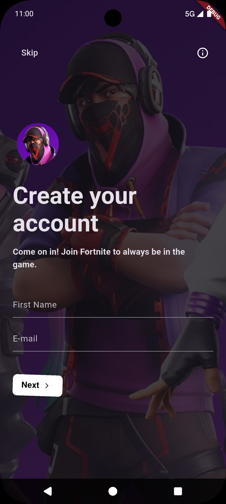
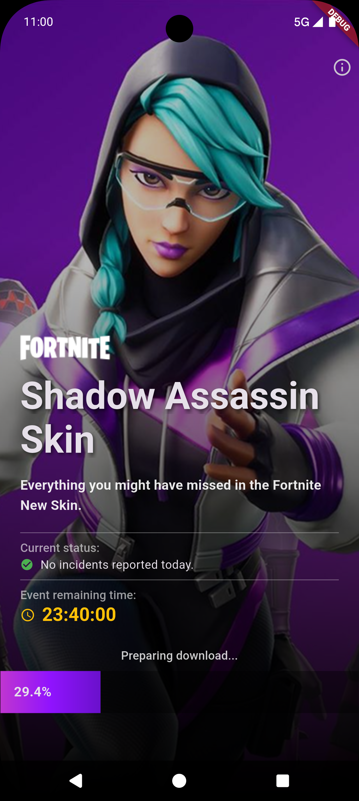
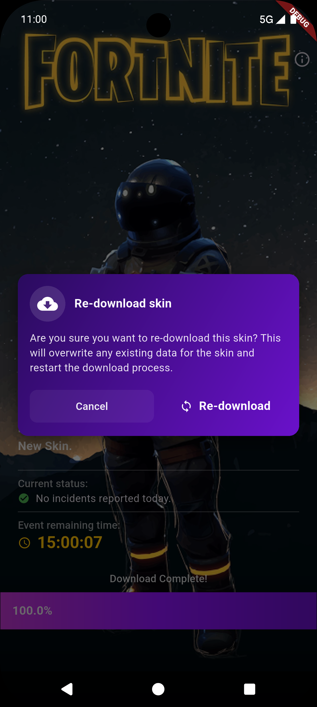

# 💚 Support Palestine  
  
> 🇵🇸 *Pray for Palestine*

---

# ⚔️ Fortnite UI Challenge — README

## ✨ Project Summary

This repository contains two Fortnite-inspired Flutter screens built as a UI challenge:

- **Fortnite Login Screen** — immersive, responsive login UI with neon/glow accents and animated interactions.  
- **Fortnite Skins Download Screen** — browsable skin gallery with animated cards, full-screen preview and download/progress UI.

The project focuses on clean, reusable widgets, accessible layouts, and smooth micro-interactions suitable as portfolio pieces or templates for games-themed apps.

---

## 🎨 Design & UX Goals

- Bold, high-contrast visuals with neon accents.  
- Smooth micro-interactions (scale, fade, parallax).  
- Reusable components (buttons, card, preview modal).  
- Performance: minimize rebuilds using `ValueNotifier` and lightweight animations.

---

## ⚙️ Requirements

- Flutter SDK >= 3.35.2  
- Dart >= 3.x

---

## 🚀 Run locally

```bash
flutter pub get
flutter run -d <device>
```

**Entrypoint:** `lib/main.dart` — chooses home route (login → skins)

---

## 🔧 Key Implementation Notes

- UI uses `flutter_animate` for micro-interactions.  
- Simple state uses `ValueNotifier` and `ValueListenableBuilder` to avoid heavy state libraries for this challenge.  
- Image assets are local placeholders; replace with high-res art for production.  

---

## ✅ Features

### Fortnite Login Screen
- Layered hero background with color overlay.  
- Primary CTA with press scale animation.  

### Fortnite Skins Download Screen
- Full-screen preview modal with download progress.  
---

## ScreenShots
<p align="justify">
  
  
  
</p>

## Animated Demo
<p>  
</p>

---

## 🔗 Contact

**Omar Kaialy**  
📧 dev.omar12kaialy@gmail.com  
🔗 LinkedIn: https://linkedin.com/in/omar-kaialy  
💻 GitHub: https://github.com/dev-OmarKaialy  
📱 Telegram: https://t.me/Omar_k_flutter

---

## 🛠️ License
MIT License

---
